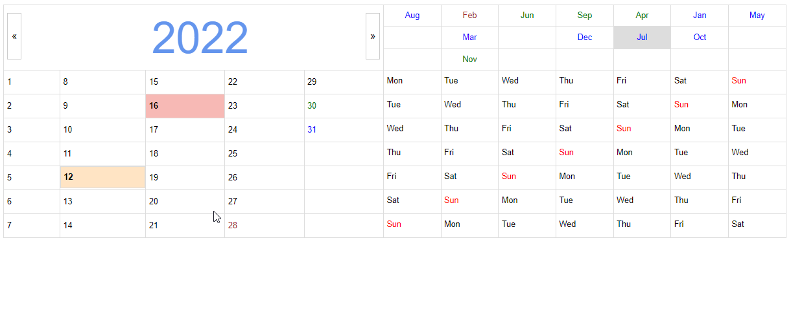
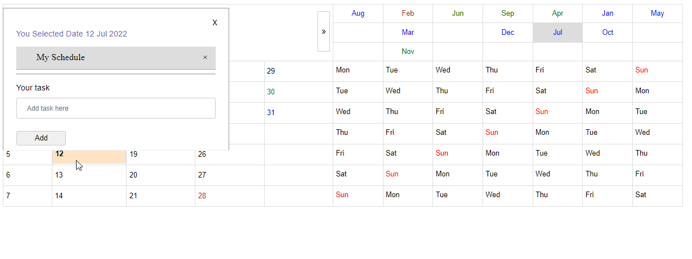

- [0. Calendar Introduction](#0-calendar-introduction)
- [1. Calendar's basic functionality](#1-calendars-basic-functionality)
- [2. Show month wise date](#2-show-month-wise-date)
- [3. Show Scheduled date with highlighted cell](#3-show-scheduled-date-with-highlighted-cell)
- [4. Clicking on date will have a popup](#4-clicking-on-date-will-have-a-popup)
- [5. User can add schedule](#5-user-can-add-schedule)
- [6. User can Edit the schedule](#6-user-can-edit-the-schedule)
- [7. User can delete any schedule.](#7-user-can-delete-any-schedule)
- [8. Changes to Add](#8-changes-to-add)

<!--START_SECTION:waka-->
<!--END_SECTION:waka-->

# 0. Calendar Introduction

- When you run calendar app on browser you will see something like shown in image.
- Red highlighted date is today's date.
- By Default current month is getting selected with current year

  

# 1. Calendar's basic functionality

- From left and right arrow shown in image we can change the year and accordingly months will get changed.
- Dates and Days remains as it is.

# 2. Show month wise date

- You can change month by clicking on month section.
- For all months 31 days will be shown, and this is not a error. e.g. If you click on Jun month and still it will show a 31 days.
- But, if you try to click on the 31 of Jun month then it will give an popup of not valid date

  

- CSS has been applied for avoid the confusion.
- Months which has 31 days are shown in blue.
- Months which has 30 days are shown in green and February is showing in Yellow.
- Similar CSS has been applied on date 28,29,30 and 31.
- On Leap year 29 will be shown in yellow.

# 3. Show Scheduled date with highlighted cell

- As shown in image date 17 is schedulled date.

# 4. Clicking on date will have a popup

- On click on date popup will get created as show in image.

# 5. User can add schedule

- In text box User can add schedule and click on the add button
- Then that schedule is automatically get added for a particular date. and will visible on popup
  
- As my schedule has been added.

# 6. User can Edit the schedule

- For editing a schedule User need to click on the scheduled date.
- Then popup will open and then User needs to click on the schedule whichever he/she wants to edit.
  

- Then that schedule will come in a text box and add button will change to update.
- User change the text and click on the update button and that text will get updated .
  

# 7. User can delete any schedule.

- By clicking x button in front of any schedule, user can delete that schedule.
  

  # 8. Changes to Add

- [ ] Remove date 31 from month of 30 days.
- [ ] Do similar necessary changes for February month.
